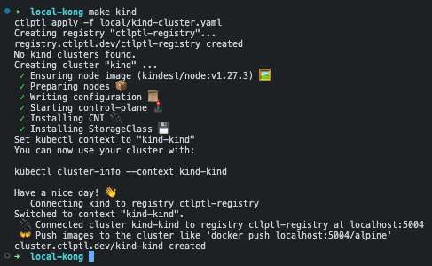
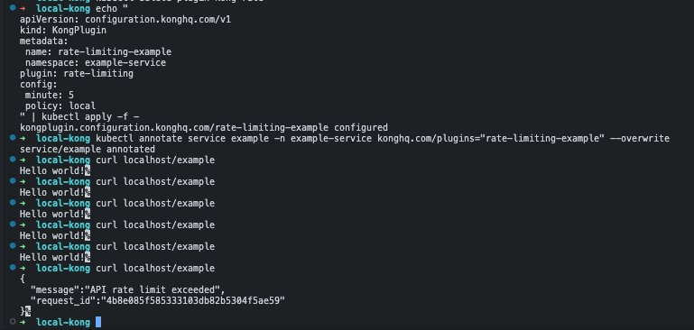
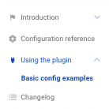

# Introduction

This repository provides scripts, manifests, and guides to quickly get Kong and a test-service up and running in a local kubernetes cluster. The guide then covers how to configure the test-service with various plugins.

# Requirements:
  - [Docker](https://docs.docker.com/desktop)
  - [Kind](https://kind.sigs.k8s.io/docs/user/quick-start/#installing-with-a-package-manager)
  - [Ctlptl](https://github.com/tilt-dev/ctlptl)
  - [Kubectl](https://kubernetes.io/docs/tasks/tools/)
  - [Helm](https://helm.sh/docs/intro/install/)
  - Make (Pre-installed in most Linux distributions)

# Table of Contents
- [Introduction](#introduction)
- [Requirements:](#requirements)
- [Table of Contents](#table-of-contents)
- [Set up local environment](#set-up-local-environment)
  - [Install requirements](#install-requirements)
  - [Create kind cluster](#create-kind-cluster)
  - [Install kong](#install-kong)
  - [Deploy example-service](#deploy-example-service)
  - [Cleanup](#cleanup)
- [Guide](#guide)
  - [The Ingress resource](#the-ingress-resource)
  - [Plugins](#plugins)
    - [Example: Rate-limiting](#example-rate-limiting)
    - [Example: Cors](#example-cors)
    - [Adding other plugins](#adding-other-plugins)
    - [Kong Manager (Open-Source version)](#kong-manager-open-source-version)
  - [Sidenote: TCP/UDP-Ingresses](#sidenote-tcpudp-ingresses)
- [References:](#references)


# Set up local environment
**Note:** All `make` commands are ran from root directory of this repository, make sure to clone it to your local environment. 

## Install requirements

Start by installing the [Requirements](#requirements) and clone this repository.

Move into the folder

```sh
cd local-kong-guide
```

## Create kind cluster 

```sh
make kind
```



This starts up Kind cluster with local registry. Port-forwarding to host is enabled for the following ports:
-    80 (proxy)
-   443 (proxy-https)
-  8001 (admin-api)
- 30000 (manager) to host.

## Install kong
```sh
make kong
```

## Deploy example-service

```sh
make example-service
curl localhost/example
```

Our example service / dummy-api which will be available from `http://localhost/example`


# Guide

## The Ingress resource

We will assume you have some familiarity with kubernetes resources like Deployment, Services, and Pods - which are the basic blocks to get your application up and running in a kubernetes environment.

When your application is up and running, the next step is to configure an `Ingress` to route traffic into your service.

The example application deployed above (`make example-service`) is exposed using the following Ingress-manifest (./local/test-service.yaml)

```
apiVersion: networking.k8s.io/v1
kind: Ingress
metadata:
  creationTimestamp: null
  name: example-ingress
  namespace: example-service
  annotations:
    konghq.com/strip-path: "true"
spec:
  ingressClassName: kong
  rules:
  - host: localhost
    http:
      paths:
      - backend:
          service:
            name: example
            port:
              number: 4000
        path: /example
        pathType: ImplementationSpecific
```

"localhost" is used as the api-gateway url, and the path to our example-service is `/example`. Route-paths to our api will work as expected due to kong stripping away the `/example` from the request path (due to the annotation `konghq.com/strip-path: "true"`)

## Plugins

You can add extra functionality to your API requests/responses without modifying the core code of your application by using "Kong Plugins"

This is done with the `KongPlugin` kubernetes resource. The primary purpose of Kong Plugins is to extend the capabilities of your API gateway with additional features like authentication, security, traffic control, and logging. They act as middleware intercepting and processing requests and responses as they pass through the Kong Gateway.

The KongPlugin resource only needs to be defined once and can be applied to any service, consumer, or route in the namespace.


### Example: Rate-limiting

First, you need to create a KongPlugin resource with your desired configuration.

Run the following command to create a rate-limiting plugin in the example-service namespace.

```sh
echo "
apiVersion: configuration.konghq.com/v1
kind: KongPlugin
metadata:
 name: rate-limiting-example
 namespace: example-service
plugin: rate-limiting
config:
 minute: 5
 policy: local
" | kubectl apply -f -
```


Now that we have configured and created our rate-limiting plugin, it is ready to be applied to our service.

```bash
kubectl annotate service example -n example-service konghq.com/plugins="rate-limiting-example"
```

After trying to curl our test-service more than the treshold (5 per minute), we should see an error:



### Example: Cors

https://docs.konghq.com/hub/kong-inc/rate-limiting/configuration/

Run the following command to create a cors plugin in the example-service namespace.

```sh
echo "
apiVersion: configuration.konghq.com/v1
kind: KongPlugin
metadata:
 name: cors-example
 namespace: example-service 
 annotations:
   kubernetes.io/ingress.class: "kong"
plugin: cors
config:
 origins:
 - http://localhost:3000
 methods:
 - GET
 - POST
 - OPTIONS
 - PUT
 - DELETE
 - PATCH
 - TRACE
 headers:
 - Accept
 - Accept-Version
 - Content-Length
 - Content-MD5
 - Content-Type
 - Date
 - X-Auth-Token
 - Authorization
 - Authentication
 exposed_headers:
 - X-Auth-Token
 credentials: true
 max_age: 3600
 preflight_continue: false
" | kubectl apply -f -
```

Now that we have configured and created our Cors plugin, it is ready to be applied to our service.

This is done by `annotating` the kubernetes service resource with `konghq.com/plugins`, and the name of our plugin(s), comma-separated:


```bash
kubectl annotate service example -n example-service konghq.com/plugins="rate-limiting-example,cors-example" --overwrite
```

When trying to reach our service now, we can see that the access-control headers are added:


###  Adding other plugins

An overview over all plugins available can be viewed here: https://docs.konghq.com/hub

These plugins can be created and enabled by following the configuration examples:




Note that community plugins are not enabled by default and must be enable in the kong-instance on a per-plugin basis. Some plugins are only available with Kong Enterprise.

### Kong Manager (Open-Source version)

[Kong manager](https://docs.konghq.com/gateway/latest/kong-manager-oss/) is now available in the open source version of kong and provides a web UI to resources managed by kong.

In this local setup it is available at `localhost:30000`.

There we can quickly get an overview over routes/ingresses:


our configured plugins:


and services managed by kong:


## Sidenote: TCP/UDP-Ingresses

The `Ingress` kubernetes resource only officially supports routing external HTTP(s) traffic to services.

Kong can be configured to receive external TCP/UDP traffic from non-HTTP protocols and route them to internal services using custom resources `TCPIngress` or `UDPIngress`. This requires the kong administrator to update kong to listen to new port. Ref [docs](https://docs.konghq.com/kubernetes-ingress-controller/latest/guides/services/tcp/).

Create a TCPIngress based on this template:


```
apiVersion: configuration.konghq.com/v1beta1
kind: TCPIngress
metadata:
  annotations:
    kubernetes.io/ingress.class: kong
  name: tcpingress-example-name
  namespace: <your namespace>
spec:
  rules:
    - backend:
        serviceName: <Your service>
        servicePort: <Service port>
      port: <Port Kong listens to>
```

Example:


```
apiVersion: configuration.konghq.com/v1beta1
kind: TCPIngress
metadata:
  annotations:
    kubernetes.io/ingress.class: kong
  name: postgres-tcpingress
  namespace: example-project
spec:
  rules:
    - backend:
        serviceName: postgres-service
        servicePort: 5432
      port: 31234

```

Example above would make kong listen to TCP traffic on port 31234, and send it to postgres-service on port 5432.

## Cleanup your local environment

Deleting test-service: 
```sh
`kubectl delete -f ./local/test-service.yaml`
```

Cleanup/Destroy local environment: 
```sh
`make destroy`
```


# References:
  - [Kong Docs](https://docs.konghq.com)
  - [Kong Plugin Hub](https://docs.konghq.com/hub/)
  - [TCPIngress](https://docs.konghq.com/kubernetes-ingress-controller/latest/guides/services/tcp/)